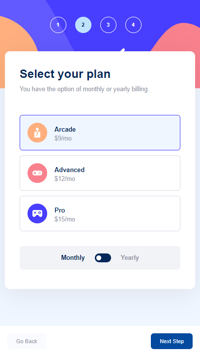
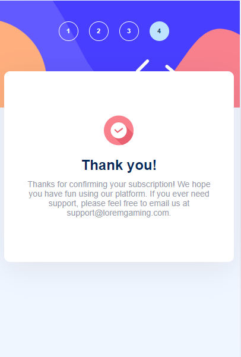

# Frontend Mentor - Multi-step form solution

This is a solution to the [Multi-step form challenge on Frontend Mentor](https://www.frontendmentor.io/challenges/multistep-form-YVAnSdqQBJ). Frontend Mentor challenges help you improve your coding skills by building realistic projects.

## Table of contents

- [Overview](#overview)
  - [The challenge](#the-challenge)
  - [Screenshots](#screenshots)
- [Tech Stack](#tech-stack)
- [Author](#author)

## Overview

### The challenge

Users should be able to:

- Complete each step of the sequence
- Go back to a previous step to update their selections
- See a summary of their selections on the final step and confirm their order
- View the optimal layout for the interface depending on their device's screen size
- See hover and focus states for all interactive elements on the page
- Receive form validation messages if:
  - A field has been missed
  - The email address is not formatted correctly
  - A step is submitted, but no selection has been made

### Screenshots

| Desktop                                     | Mobile                                    |
| ------------------------------------------- | ----------------------------------------- |
|     |     |
|     |     |
|     |     |
|     |     |
|  |  |

## Tech Stack

- [React](https://reactjs.org/)
- [CSS Modules](https://css-tricks.com/css-modules-part-1-need/) - For styles

## Author

- Frontend Mentor - [@Dogukanays](https://www.frontendmentor.io/profile/Dogukanays)
- Linkedin - [@dogukan-aysan](https://www.linkedin.com/in/dogukan-aysan/)
- Email - <dogukanaysan01@gmail.com>
